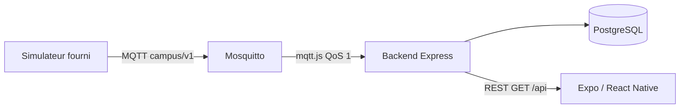

# Architecture — Campus connecté

## Chaîne de la donnée

| Étape | Rôle | Technologie |
|---|---|---|
| Capteur | Produit température, CO₂, état, disponibilité | Simulateur Python du kit |
| Transport | Publication / abonnement, retained, Last Will | Mosquitto MQTT 3.1.1 |
| Backend | Valide, identifie l’objet, persiste, expose l’API | Node.js, Express, mqtt.js, Zod |
| Stockage | Dernier état + historique borné | PostgreSQL, Prisma |
| Mobile | Affiche mesures, unités, dates et états d’UI | React Native, Expo |

Le téléphone ne se connecte pas au broker. Le backend porte les règles, l’historique et (à partir de J3) les droits et le suivi des commandes.

## Pourquoi une API et un broker n’ont pas le même rôle

Le broker achemine des messages sans connaître les salles, les utilisateurs ni l’historique métier. L’API répond à des requêtes du téléphone : dernier état d’une salle, fraîcheur, erreurs explicites. MQTT est publication/abonnement ; HTTP est requête/réponse.

## Actualisation

L’application interroge `GET /api/rooms` toutes les 3 secondes. Une mesure est **récente** si son `observed_at` a moins de **10 secondes** (environ cinq publications manquées du simulateur, intervalle 2 s). La disponibilité MQTT (`online` / `offline`) est une information distincte : un objet peut être connecté et pourtant n’émettre plus de télémétrie (`pause`).

## Identifiants

Les objets `sensor-001` à `sensor-003` restent les mêmes du topic MQTT jusqu’à l’écran. `message_id` identifie une observation. `room_id` initial vient du kit ; le registre backend pourra diverger après association QR (J3).

## Paramètres

| Clé | Valeur J1 |
|---|---|
| `FRESHNESS_MS` | 10000 |
| `COMMAND_TIMEOUT_MS` | 15000 (prévu J3) |
| `ALERT_CO2_PPM` | 1500 (prévu J4) |
| `HISTORY_LIMIT` | 200 |

Pourquoi PostgreSQL et un CQRS léger : [décision 002](decisions/002-architecture.md).
