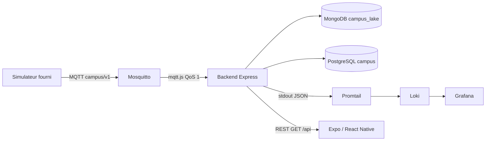

# Architecture — Campus connecté

## Chaîne de la donnée

| Étape | Rôle | Technologie |
|---|---|---|
| Capteur | Produit température, CO₂, état, disponibilité | Simulateur Python du kit |
| Transport | Publication / abonnement, retained, Last Will | Mosquitto MQTT 3.1.1 |
| Backend | Valide, identifie l’objet, persiste, expose l’API | Node.js, Express, mqtt.js, Zod |
| Data lake | Tout message MQTT brut, timestampé, TTL 7 jours | MongoDB `campus_lake` |
| Stockage API | Dernier état + 200 mesures + moyennes 10 min / 30 j | PostgreSQL `campus`, Prisma |
| Observabilité | Logs structurés, filtres par device / eventType | Pino → Promtail → Loki → Grafana |
| Mobile | Affiche mesures, cache local, états réseau distincts | React Native, Expo, Zustand, AsyncStorage, NetInfo |

Le téléphone ne se connecte pas au broker. Le backend porte les règles, l’historique et l’observabilité du traitement.

## Identité des objets et topics

| Identifiant | Où | Rôle |
|---|---|---|
| `device_id` | Topic `campus/v1/devices/{id}/{kind}`, payload, `Device.id` | Identité stable de l’objet |
| `message_id` | Payload télémétrie, `Measurement.messageId`, log `eventId` | Identité d’une observation (dédup + corrélation) |
| `room_id` | Payload + `Device.roomId` | Affectation salle (registre backend) |

Topics consommés par le backend : `telemetry`, `state`, `availability` (wildcard `+` sur le device).

**Validation avant le cœur métier :** JSON parseable → schéma Zod (contrat + bornes métier) → `device_id` == segment topic → device connu du registre → `observed_at` pas trop dans le futur. Sinon `telemetry.rejected` (ou équivalent) et **pas** d’écriture PostgreSQL métier. Le lake Mongo peut quand même conserver le brut.

**Autorité salle :** le registre `Device.roomId` (catalogue) fait foi pour l’API et les écritures `Measurement` ; un `room_id` payload divergent est logué (`telemetry.room_mismatch`) mais n’affecte pas l’affectation produit. Détail : [décision 009](decisions/009-business-validation-room-concurrency.md).

ACL Mosquitto : comptes `simulator`, `backend`, `teacher`. Détail : [décision 006](decisions/006-device-identity.md).

## Pourquoi une API et un broker n’ont pas le même rôle

Le broker achemine des publications MQTT sans modèle métier. L’API traduit un état déjà validé pour le téléphone (salles, fraîcheur, erreurs HTTP). MQTT est publication/abonnement ; HTTP est requête/réponse.

## Actualisation et fraîcheur

L’application interroge `GET /api/rooms` toutes les 3 secondes. Le **détail d’une salle** charge `GET /api/devices/:id/history`. Une mesure est **récente** (`fresh`) si `now - observed_at < FRESHNESS_MS` (10 s) ; sinon `stale`.

La disponibilité MQTT (`online` / `offline`, LWT) est **distincte** : un objet peut rester `online` sans télémétrie (`pause`) — l’UI affiche « Donnée ancienne », pas « Téléphone hors ligne ».

## Règles d’ingestion (fiabilité)

| Cas | Comportement | `eventType` |
|---|---|---|
| Mesure valide | Insert `Measurement` + éventuelle MAJ `Device` | `telemetry.ingested` |
| Doublon `message_id` | Ignoré (contrainte unique) | `telemetry.duplicate` |
| `observed_at` plus ancien que le latest (ou course perdue) | Conservé en historique, latest inchangé | `telemetry.stale_kept` |
| Hors plage métier / `observed_at` futur | Rejet métier | `telemetry.rejected` |
| `room_id` payload ≠ registre | Log ; écriture avec `Device.roomId` | `telemetry.room_mismatch` |
| Schéma / JSON / mismatch topic | Rejet, pas de crash | `telemetry.rejected` |
| Broker coupé | Reconnexion auto | `mqtt.disconnected` → `mqtt.connected` |

La MAJ du latest est **conditionnelle** (`lastObservedAt <= incoming`) pour rester correcte sous traitements concurrents.

## Deux bases

| Base | Rôle | Contenu | Consommateur |
|---|---|---|---|
| `campus_lake` (MongoDB) | Data lake — flux brut | collection `mqtt_events` (append-only, TTL 7 j) | audit |
| `campus` (PostgreSQL) | Données **propres** pour le produit | `Device`, `Measurement` (200), `MeasurementAverage` (30 j) | `GET /api/*`, mobile |

Chaque message MQTT est d’abord **inséré** dans Mongo (`insertOne`, jamais d’update), puis traité par les règles métier. L’API ne lit **jamais** le lake.

## Persistance API (`campus`)

- **`Measurement`** : journal append-only (sauf purge de borne). Contrainte unique sur `message_id` → doublon MQTT ignoré.
- **`MeasurementAverage`** : moyenne 10 min, 30 jours.
- **`Device`** : projection du dernier état. Une mesure en retard ne fait pas reculer `lastObservedAt`.
- **Borne brute** : `HISTORY_LIMIT` (200) mesures par objet.

## Data lake (`campus_lake` / MongoDB)

- Collection **`mqtt_events`** : `topic`, `deviceId`, `messageKind`, `messageId`, `payloadRaw`, `payload`, `receivedAt`.
- **TTL 7 jours** sur `receivedAt`.

## Observabilité (J3)

- stdout JSON (pas de pretty-print en Compose).
- Promtail scrape le conteneur `backend` → Loki → Grafana (`:3001`).
- Requêtes : [observability/README.md](../observability/README.md). Décision : [007](decisions/007-observability.md).

## Cache mobile

Après une lecture réussie, les salles sont sauvées dans AsyncStorage avec `cachedAt`. Hors ligne (NetInfo), l’app affiche ce cache. La **fraîcheur** est recalculée localement depuis `observed_at` (même règle 10 s que l’API) : le snapshot serveur ne reste pas figé. Trois bandeaux : téléphone hors ligne / donnée ancienne / objet hors ligne.

## Indisponibilité broker

Session MQTT `clean: true`, abonnements QoS 1. Coupure → logs `mqtt.*` → reprise automatique. Pas de file durable des mesures pendant l’arrêt du **backend**. Détail : [008](decisions/008-broker-qos.md).

## Paramètres

| Clé | Valeur |
|---|---|
| `FRESHNESS_MS` | 10000 |
| `COMMAND_TIMEOUT_MS` | 15000 (prévu journée commandes) |
| `ALERT_CO2_PPM` | 1500 (prévu alertes) |
| `HISTORY_LIMIT` | 200 |
| `AVERAGE_WINDOW_MS` | 600000 (10 min) |
| `AVERAGE_RETENTION_MS` | 2592000000 (30 j) |
| `LAKE_TTL_SECONDS` | 604800 (7 j) |

Décisions : [001 stack](decisions/001-stack.md), [002 CQRS](decisions/002-architecture.md), [003 dédup/cache](decisions/003-deduplication-cache.md), [004 dual DB](decisions/004-dual-database.md), [005 rétention](decisions/005-retention.md), [006 identité](decisions/006-device-identity.md), [007 observabilité](decisions/007-observability.md), [008 broker/QoS](decisions/008-broker-qos.md), [009 validation métier / room / concurrence](decisions/009-business-validation-room-concurrency.md).
