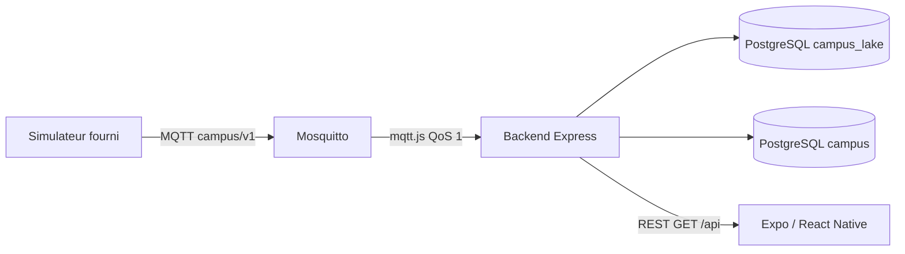

# Architecture — Campus connecté

## Chaîne de la donnée

| Étape | Rôle | Technologie |
|---|---|---|
| Capteur | Produit température, CO₂, état, disponibilité | Simulateur Python du kit |
| Transport | Publication / abonnement, retained, Last Will | Mosquitto MQTT 3.1.1 |
| Backend | Valide, identifie l’objet, persiste, expose l’API | Node.js, Express, mqtt.js, Zod |
| Data lake | Tout message MQTT brut + outcome d’ingestion | PostgreSQL `campus_lake`, Prisma |
| Stockage API | Dernier état + historique borné (`HISTORY_LIMIT`) | PostgreSQL `campus`, Prisma |
| Mobile | Affiche mesures, cache local, états réseau distincts | React Native, Expo, AsyncStorage, NetInfo |

Le téléphone ne se connecte pas au broker. Le backend porte les règles, l’historique et (à partir de J3) les droits et le suivi des commandes.

## Pourquoi une API et un broker n’ont pas le même rôle

Le broker achemine des messages sans connaître les salles, les utilisateurs ni l’historique métier. L’API répond à des requêtes du téléphone : dernier état d’une salle, fraîcheur, erreurs explicites. MQTT est publication/abonnement ; HTTP est requête/réponse.

## Actualisation et fraîcheur

L’application interroge `GET /api/rooms` toutes les 3 secondes. Une mesure est **récente** (`fresh`) si son `observed_at` a moins de **10 s** (`FRESHNESS_MS`) ; sinon `stale`. La disponibilité MQTT (`online` / `offline`) est distincte : un objet peut rester `online` sans télémétrie (`pause`) — l’UI affiche alors « Donnée ancienne », pas « Téléphone hors ligne ».

## Deux bases

| Base | Rôle | Tables clés | Consommateur |
|---|---|---|---|
| `campus_lake` | Data lake — **tout** ce qui arrive | `RawMqttEvent` | audit, debug, futur analytics |
| `campus` | Données **propres** pour le produit | `Device`, `Measurement` (+ J3 : users, commands) | `GET /api/*`, mobile |

Chaque message MQTT est d’abord écrit dans le lake (`recordRawMessage`), puis traité par les règles métier. L’API ne lit **jamais** le lake.

## Persistance API (`campus`)

- **`Measurement`** : journal append-only (sauf purge de borne). Contrainte unique sur `message_id` → doublon MQTT ignoré.
- **`Device`** : projection du dernier état. Une mesure en retard est stockée mais ne fait pas reculer `lastObservedAt`.
- **Borne** : après insertion, au plus `HISTORY_LIMIT` (200) mesures par objet (les plus récentes par `observedAt`).

## Data lake (`campus_lake`)

- **`RawMqttEvent`** : topic, payload brut, JSON parsé si possible, `outcome` (`ingested`, `rejected`, `duplicate`, `stale`, `unknown_device`, `ignored_topic`).
- Pas de borne : conserve rejets et doublons pour analyse.

## Cache mobile

Après une lecture réussie, les salles sont sauvées dans AsyncStorage avec `cachedAt`. Hors ligne (NetInfo), l’app affiche ce cache avec dates. Au retour au premier plan (AppState `active`), un seul polling reprend sans écran de chargement infini si le cache existe. Pas de file de commandes hors ligne (J3).

Trois bandeaux distincts :

| Signal | Signification |
|---|---|
| Téléphone hors ligne | NetInfo : pas de réseau sur le mobile |
| Donnée ancienne | `freshness: stale` (mesure trop vieille) |
| Objet hors ligne | `availability: offline` (MQTT / LWT) |

## Identifiants

Les objets `sensor-001` à `sensor-003` restent les mêmes du topic MQTT jusqu’à l’écran. `message_id` identifie une observation. `room_id` initial vient du kit ; le registre backend pourra diverger après association QR (J3).

## Paramètres

| Clé | Valeur |
|---|---|
| `FRESHNESS_MS` | 10000 |
| `COMMAND_TIMEOUT_MS` | 15000 (prévu J3) |
| `ALERT_CO2_PPM` | 1500 (prévu J4) |
| `HISTORY_LIMIT` | 200 |

Pourquoi PostgreSQL et un CQRS léger : [décision 002](decisions/002-architecture.md). Déduplication et cache : [décision 003](decisions/003-deduplication-cache.md). Deux bases lake/API : [décision 004](decisions/004-dual-database.md).
