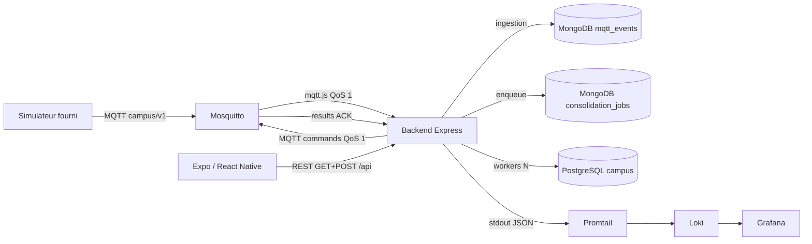

# Architecture — Campus connecté

## Chaîne de la donnée


```mermaid
flowchart LR
    S["Simulateur fourni"] -->|"MQTT campus/v1"| M["Mosquitto"]
    M -->|"mqtt.js QoS 1"| B["Backend Express"]
    B -->|"ingestion"| LAKE[("MongoDB mqtt_events")]
    B -->|"enqueue"| Q[("MongoDB consolidation_jobs")]
    B -->|"workers N"| PG[("PostgreSQL campus")]
    B -->|"stdout JSON"| P["Promtail"]
    P --> L["Loki"]
    L --> G["Grafana"]
    A["Expo / React Native"] -->|"REST GET+POST /api"| B
    B -->|"MQTT commands QoS 1"| M
    M -->|"results ACK"| B
```

| Étape | Rôle | Technologie |
|---|---|---|
| Capteur | Produit température, CO₂, état, disponibilité | Simulateur Python du kit |
| Transport | Publication / abonnement, retained, Last Will | Mosquitto MQTT 3.1.1 |
| Backend | Ingestion lake + file ; consolidation workers ; API | Node.js, Express, mqtt.js, Zod |
| Data lake | Tout message MQTT brut, timestampé, TTL 7 jours | MongoDB `mqtt_events` (append-only) |
| File consolidation | États pending → processed ; claim atomique | MongoDB `consolidation_jobs` |
| Stockage API | Dernier état + 200 mesures + moyennes 10 min / 30 j | PostgreSQL `campus`, Prisma |
| Observabilité | Logs structurés, filtres par device / eventType | Pino → Promtail → Loki → Grafana |
| Mobile | Affiche mesures, envoie commandes, cache local | React Native, Expo, Zustand, AsyncStorage, NetInfo |

Le téléphone ne se connecte pas au broker. Le backend porte les règles, l’historique, les commandes et l’observabilité du traitement.

## Identité des objets et topics

| Identifiant | Où | Rôle |
|---|---|---|
| `device_id` | Topic `campus/v1/devices/{id}/{kind}`, payload, `Device.id` | Identité stable de l’objet |
| `message_id` | Payload télémétrie, `Measurement.messageId`, log `eventId` | Identité d’une observation (dédup + corrélation) |
| `command_id` | Payload commande / résultat, `Command.id`, log `commandId` | Corrélation demande → ACK |
| `room_id` | Payload + `Device.roomId` | Affectation salle (registre backend) |

Topics consommés par le backend : `telemetry`, `state`, `availability`, `results` (wildcard `+` sur le device).  
Topic publié par le backend : `campus/v1/devices/{device_id}/commands` (QoS 1, **non retained**).

## Flux descendant — commandes (J4)

```text
Mobile POST /api/devices/:id/commands
  → Command PENDING (Postgres)
  → publish MQTT …/commands
  → Command SENT
  → objet exécute + publish …/results
  → lake + consolidation → rattache command_id
  → ACKNOWLEDGED | FAILED
  (sinon TIMEOUT à expires_at = now + COMMAND_TIMEOUT_MS)
```

| Étape | Ce que le système sait |
|---|---|
| `PENDING` | API a accepté ; pas encore publié (fenêtre courte) |
| `SENT` | Publié MQTT ; exécution **non** confirmée |
| `ACKNOWLEDGED` | Objet a renvoyé `executed` pour ce `command_id` |
| `FAILED` | Objet a renvoyé `rejected` (ou échec publish) |
| `TIMEOUT` | Aucun ACK avant `expires_at` ; un ACK tardif est journalisé (`command.ack_late`) sans repasser en succès |

API : `POST/GET /api/devices/:deviceId/commands[/:commandId]`. Détail : [ADR 011](decisions/011-command-lifecycle.md).

**Validation avant le cœur métier :** JSON parseable → schéma Zod (contrat + bornes métier) → `device_id` == segment topic → device connu du registre → `observed_at` pas trop dans le futur. Sinon `telemetry.rejected` (ou équivalent) et **pas** d’écriture PostgreSQL métier. Le lake Mongo peut quand même conserver le brut.

**Autorité salle :** le registre `Device.roomId` (catalogue) fait foi pour l’API et les écritures `Measurement` ; un `room_id` payload divergent est logué (`telemetry.room_mismatch`) mais n’affecte pas l’affectation produit. Détail : [décision 009](decisions/009-business-validation-room-concurrency.md).

ACL Mosquitto : comptes `simulator`, `backend`, `teacher`. Détail : [décision 006](decisions/006-device-identity.md).

## Pourquoi une API et un broker n’ont pas le même rôle

Le broker achemine des publications MQTT sans modèle métier. L’API traduit un état déjà validé pour le téléphone (salles, fraîcheur, erreurs HTTP). MQTT est publication/abonnement ; HTTP est requête/réponse.

## Actualisation et fraîcheur

L’application interroge `GET /api/rooms` toutes les 3 secondes. Le **détail d’une salle** charge `GET /api/devices/:id/history`. Une mesure est **récente** (`fresh`) si `now - observed_at < FRESHNESS_MS` (10 s) ; sinon `stale`.

La disponibilité MQTT (`online` / `offline`, LWT) est **distincte** : un objet peut rester `online` sans télémétrie (`pause`) — l’UI affiche « Donnée ancienne », pas « Téléphone hors ligne ».

## Règles d’ingestion (fiabilité)

| Cas | Comportement | `eventType` |
|---|---|---|
| Mesure valide | Insert `Measurement` + éventuelle MAJ `Device` | `telemetry.ingested` |
| Doublon `message_id` | Ignoré (contrainte unique) | `telemetry.duplicate` |
| `observed_at` plus ancien que le latest (ou course perdue) | Conservé en historique, latest inchangé | `telemetry.stale_kept` |
| Hors plage métier / `observed_at` futur | Rejet métier | `telemetry.rejected` |
| `room_id` payload ≠ registre | Log ; écriture avec `Device.roomId` | `telemetry.room_mismatch` |
| Schéma / JSON / mismatch topic | Rejet, pas de crash | `telemetry.rejected` |
| Broker coupé | Reconnexion auto | `mqtt.disconnected` → `mqtt.connected` |

La MAJ du latest est **conditionnelle** (`lastObservedAt <= incoming`) pour rester correcte sous traitements concurrents.

## Deux bases (+ file de consolidation)

| Base | Rôle | Contenu | Consommateur |
|---|---|---|---|
| `campus_lake.mqtt_events` | Data lake — flux brut append-only | topic, payload, receivedAt, TTL 7 j | audit / rejeu manuel |
| `campus_lake.consolidation_jobs` | File d’attente consolidation | status, attempts, locks, payloadRaw | workers backend |
| `campus` (PostgreSQL) | Données **propres** pour le produit | Device, Measurement, averages | `GET /api/*`, mobile |

**Ingestion** = insert lake + enqueue job (sans Postgres). **Consolidation** = N workers (`CONSOLIDATION_WORKERS`) qui claiment un job et écrivent Postgres. Détail : [review 4-5-6](review-4-5-6.md), [ADR 010](decisions/010-ingestion-consolidation.md).

## Health

| Endpoint | Sens |
|---|---|
| `/health/live` | Process vivant |
| `/health/ready` | Postgres + Mongo OK |
| `/health` | Synthèse `healthy` / `degraded` / `unavailable` + lag consolidation |

MQTT déconnecté ⇒ `degraded` (API encore lisible). PG ou Mongo down ⇒ `unavailable` (503).

## Persistance API (`campus`)

- **`Measurement`** : journal append-only (sauf purge de borne). Contrainte unique sur `message_id` → doublon MQTT ignoré.
- **`MeasurementAverage`** : moyenne 10 min, 30 jours.
- **`Device`** : projection du dernier état. Une mesure en retard ne fait pas reculer `lastObservedAt`.
- **Borne brute** : `HISTORY_LIMIT` (200) mesures par objet.

## Data lake (`campus_lake` / MongoDB)

- Collection **`mqtt_events`** : `topic`, `deviceId`, `messageKind`, `messageId`, `payloadRaw`, `payload`, `receivedAt`.
- **TTL 7 jours** sur `receivedAt`.

## Observabilité (J3)

- stdout JSON (pas de pretty-print en Compose).
- Promtail scrape le conteneur `backend` → Loki → Grafana (`:3001`).
- Requêtes : [observability/README.md](../observability/README.md). Décision : [007](decisions/007-observability.md).

## Cache mobile

Après une lecture réussie, les salles sont sauvées dans AsyncStorage avec `cachedAt`. Hors ligne (NetInfo), l’app affiche ce cache. La **fraîcheur** est recalculée localement depuis `observed_at` (même règle 10 s que l’API) : le snapshot serveur ne reste pas figé. Trois bandeaux : téléphone hors ligne / donnée ancienne / objet hors ligne.

## Indisponibilité broker

Session MQTT `clean: false` + `clientId` stable (`campus-backend`), abonnements QoS 1. Coupure → logs `mqtt.*` → reprise automatique. Pendant l’arrêt du **backend** (broker up), Mosquitto **met en file** les messages QoS ≥ 1 et les livre au retour. Détail : [008](decisions/008-broker-qos.md).

## Paramètres

| Clé | Valeur |
|---|---|
| `FRESHNESS_MS` | 10000 |
| `COMMAND_TIMEOUT_MS` | 15000 |
| `ALERT_CO2_PPM` | 1500 (prévu alertes J5) |
| `HISTORY_LIMIT` | 200 |
| `AVERAGE_WINDOW_MS` | 600000 (10 min) |
| `AVERAGE_RETENTION_MS` | 2592000000 (30 j) |
| `LAKE_TTL_SECONDS` | 604800 (7 j) |
| `CONSOLIDATION_WORKERS` | 2 |
| `CONSOLIDATION_LOCK_MS` | 30000 |
| `CONSOLIDATION_LAG_WARN_MS` | 10000 |

Décisions : [001 stack](decisions/001-stack.md), [002 CQRS](decisions/002-architecture.md), [003 dédup/cache](decisions/003-deduplication-cache.md), [004 dual DB](decisions/004-dual-database.md), [005 rétention](decisions/005-retention.md), [006 identité](decisions/006-device-identity.md), [007 observabilité](decisions/007-observability.md), [008 broker/QoS](decisions/008-broker-qos.md), [009 validation métier / room / concurrence](decisions/009-business-validation-room-concurrency.md), [010 pipeline ingestion/consolidation](decisions/010-ingestion-consolidation.md), [011 commandes](decisions/011-command-lifecycle.md).
