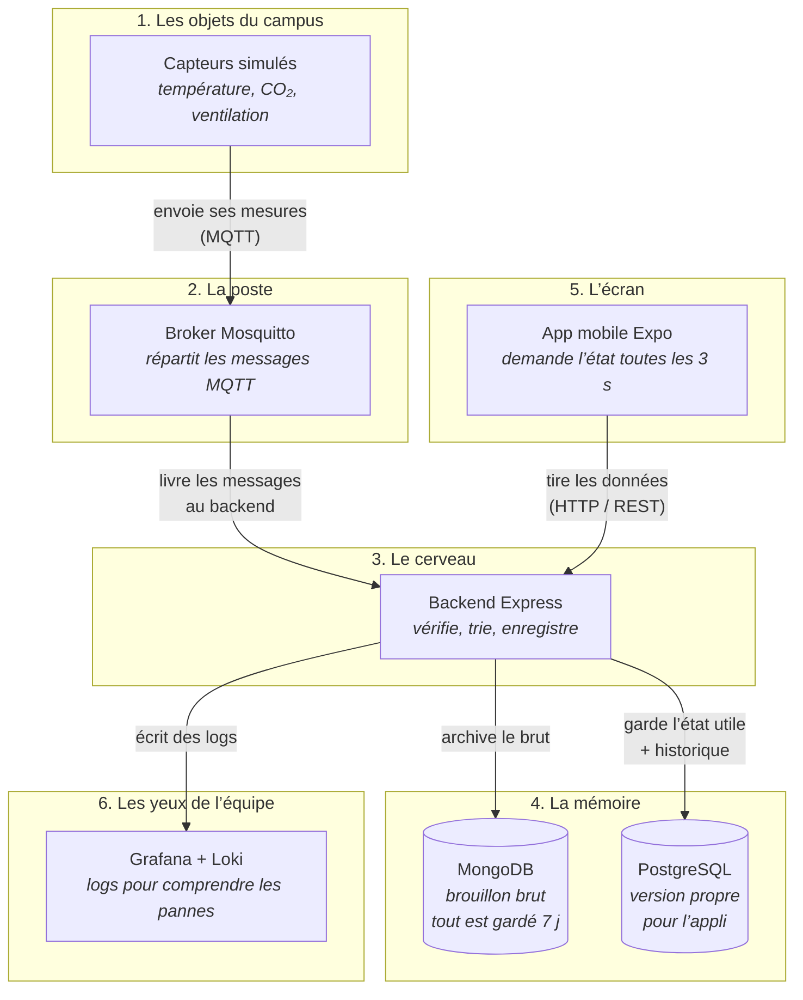

# Vulgarisation — stack et reconnexion

Support oral pour présenter le projet Campus connecté : schéma de la stack, flux entre les éléments, et explication de la perte / reprise de connexion.

## Schéma de la stack

## Ce qui se passe entre chaque élément

| De → Vers | En langage simple |
|---|---|
| **Capteur → Broker** | L’objet « poste » ses mesures (température, CO₂, « je suis en ligne »). Il ne parle pas au téléphone. |
| **Broker → Backend** | Le broker est un centre de tri : il ne décide rien, il achemine. Le backend s’y abonne et reçoit tout. |
| **Backend → Mongo** | Chaque message est d’abord rangé **tel quel** (preuve / audit), même s’il est bizarre. |
| **Backend → Postgres** | Ensuite on applique les règles : message valide ? déjà vu ? trop vieux ? → on met à jour l’état des salles. |
| **Mobile → Backend** | Le téléphone **ne parle pas MQTT**. Il demande toutes les 3 s : « donne-moi l’état des salles » en HTTP. |
| **Backend → Grafana** | Pendant ce temps, le backend raconte ce qu’il fait dans des logs (doublon, rejet, coupure MQTT…). |

**Idée clé :** les objets **poussent**, le téléphone **tire**. Le backend est le traducteur entre les deux mondes.

## Perte de connexion et reconnexion

Quand quelque chose coupe, ce n’est pas « tout le système est mort » : on distingue **qui** a perdu le fil. Si c’est le **téléphone** (Wi‑Fi coupé), l’appli garde le **dernier écran en cache** et affiche clairement qu’on est hors ligne — on n’invente pas de nouvelles mesures, on montre la dernière photo connue. Si c’est le **broker** (la poste MQTT), le backend le remarque, **se reconnecte tout seul** toutes les ~2 secondes, puis se réabonne ; pendant la coupure, quelques messages peuvent être perdus, et à la reprise on peut en recevoir **deux fois** — d’où un identifiant unique par mesure pour ne pas stocker les doublons. Si c’est le **backend** qui est arrêté **mais le broker tourne encore**, Mosquitto **garde les messages** pour le client `campus-backend` (session persistante, QoS 1) et les **livre en rafale** au redémarrage — d’où encore des doublons possibles, filtrés par `message_id`. Enfin, un objet peut rester « en ligne » mais sans envoyer de données (pause) : l’écran dit alors **donnée ancienne**, pas « téléphone hors ligne ». En résumé : on reconnecte automatiquement, on met en file côté broker quand le backend manque, et on filtre les doublons.

### Trois « hors ligne » à ne pas confondre

| Situation | Ce que ça veut dire | Ce que l’écran montre |
|---|---|---|
| Téléphone hors ligne | Plus de réseau sur le mobile | Bandeau + dernier cache AsyncStorage |
| Donnée ancienne | Plus de mesure récente (> 10 s) | Pastille « Donnée ancienne » |
| Objet hors ligne | Capteur annoncé offline (MQTT / Last Will) | « Objet hors ligne » |

Un capteur en **pause** reste online mais devient « donnée ancienne » : ce n’est pas une coupure réseau.

## Phrase courte (slide)

> Les objets poussent des mesures en MQTT vers un broker ; le backend les valide, les archive en brut (Mongo) et en propre (Postgres), puis le téléphone tire l’état via HTTP toutes les 3 secondes. Si le téléphone coupe, on montre le dernier écran en cache. Si le backend coupe (broker up), la session MQTT persistante remet les messages QoS 1 en file puis les livre au retour — les doublons éventuels sont filtrés par `message_id`.